# ☀️ Solar Filament Segmentation Challenge 2026

## Deep Learning for Pixel-Precise Solar Filament Segmentation


> **Teaching machines to recognize the magnetic structures that shape one of the Sun's most fascinating and potentially consequential phenomena.**

This repository documents my work on the **Filament Segmentation Challenge 2026**, a scientific computer-vision problem focused on automatically identifying and segmenting solar filaments in high-resolution, full-disk **H-alpha** observations.

The project combines:

**solar physics + astronomical imaging + instance segmentation + deep learning + quantitative evaluation + visual scientific analysis**

into a reproducible experimental workflow.

---

# 🌞 What Is a Solar Filament?

If you have never studied the Sun, a solar filament can be thought of as a **long, thread-like cloud of relatively cool, dense solar material suspended above the Sun's surface by magnetic fields**.

The Sun is not a solid ball with a quiet atmosphere. Its outer layers contain extremely hot plasma — electrically charged gas — and powerful, constantly changing magnetic fields.

Those magnetic fields can create structures that hold cooler plasma above the solar surface.

One of the most visually distinctive examples is a **solar filament**.

When viewed against the bright disk of the Sun, a filament usually appears as a **dark, elongated structure**.

Why does something on the Sun appear dark?

Because the filament material is much cooler than the surrounding solar atmosphere. The relatively cool material absorbs light at the **H-alpha wavelength**, making the structure appear dark against the brighter solar disk.

The important point is that the filament is not simply a dark patch.

It is a **three-dimensional magnetic structure containing plasma**, projected onto a two-dimensional image.

---

# 🧲 Filaments Are Magnetic Structures

Solar filaments generally form above regions where the magnetic field changes polarity, called **polarity inversion lines**.

A useful mental picture is:

```text
          ☀️ SOLAR SURFACE

       + + + + + | - - - - -
       + + + + + | - - - - -
       + + + + + | - - - - -
                  │
             Polarity
            Inversion Line
                  │
             ╭────────╮
          ╭──╯ FILAMENT ╰──╮
        ╭─╯                  ╰─╮
       ~~~~~~~~~~~~~~~~~~~~~~~~~~
          Magnetic structure
              supporting
             cooler plasma
```

The magnetic field provides the structure that allows relatively cool plasma to remain suspended against gravity.

This is why a filament is scientifically interesting: its visible shape contains information about the **underlying magnetic environment of the Sun**.

The MAGFiLO research paper describes filaments as dense clouds of solar material suspended by magnetic field lines above photospheric polarity-inversion lines.

---

# 🌑 Filament vs. Prominence

You may also have heard the word **prominence**.

The two terms describe essentially the same type of solar structure viewed in different circumstances.

### On the solar disk

The structure appears dark against the bright solar surface.

It is called a:

> **Filament**

### At the edge of the Sun

The same type of structure can be seen against the dark background of space and appear bright.

It is traditionally called a:

> **Prominence**

So, in simplified terms:

```text
                 ☀️ SUN

       Looking at the disk
              ↓
       ┌─────────────┐
       │   ☀️        │
       │   ╲____     │
       │    DARK     │
       │   FILAMENT  │
       └─────────────┘


       Looking at the limb
              ↓

             ☀️
          ────────
             ╲
              ╲
               ╲
              BRIGHT
            PROMINENCE
```

This project focuses on **on-disk H-alpha filament observations**.

---

# 📡 Why H-alpha?

The **H-alpha spectral line** is particularly useful for observing structures in the Sun's chromosphere.

The Global Oscillation Network Group (**GONG**) continuously produces full-disk solar images centered on the H-alpha line at approximately **6562.8 Å**.

These observations provide an enormous visual record of solar activity.

The GONG network is particularly valuable because observations are collected continuously across a network of observing sites, allowing the Sun to be monitored throughout the day.

For a computer-vision system, however, this creates an enormous challenge:

> **The Sun contains many things that can look like a filament.**

A model has to distinguish real filament material from:

* Instrumental artifacts
* Ground-based observing noise
* Bright and dark solar structures
* Sunspots
* Other chromospheric features
* Very faint filament material
* Fragmented filament structures

That is where segmentation becomes important.

---

# 🌎 Why Should Anyone Care About Solar Filaments?

This is where the problem becomes much larger than image segmentation.

Solar filaments are closely associated with **solar eruptions**, including coronal mass ejections (CMEs), solar flares, and energetic-particle events.

When a large solar eruption is directed toward Earth, it can disturb the Earth's magnetic environment.

Those disturbances can produce **geomagnetic storms**.

And geomagnetic storms are not merely an astronomical curiosity.

They can affect technological systems on Earth and in space, including:

* ⚡ Electrical power infrastructure
* 🛰️ Satellites
* 📡 Radio communications
* 🧭 Navigation systems such as GPS/GNSS
* ✈️ Aviation systems and high-altitude radiation environments
* 🌍 Other infrastructure affected by space weather

The MAGFiLO authors specifically highlight the connection between filament eruptions, CMEs, and space-weather impacts on power grids, GPS, communications, satellites, and aviation.

The National Solar Observatory similarly describes solar filaments as important clues for understanding CMEs and their potential effects on satellites, power grids, and communications.

---

# 🌩️ From a Filament to a Geomagnetic Storm

The chain of events can be simplified as:

```text
☀️ SOLAR FILAMENT
       │
       │ instability / eruption
       ▼
🌞 SOLAR ERUPTION
       │
       ▼
💨 CORONAL MASS EJECTION
       │
       │ travels through space
       ▼
🌍 EARTH'S MAGNETOSPHERE
       │
       ▼
🧲 GEOMAGNETIC STORM
       │
       ├───────────────┐
       ▼               ▼
    🛰️ Satellites    ⚡ Power grids
       │
       ├───────────────┐
       ▼               ▼
   📡 Communications   🧭 GPS/GNSS
```

Not every filament erupts.

Not every eruption is Earth-directed.

And not every solar eruption produces a severe technological impact.

But filaments are closely connected to the magnetic structures involved in many solar eruptive events, which makes their detection and characterization scientifically valuable.

---

# 🚨 The Operational Gap

For decades, solar observatories have monitored filaments because they can provide important information about solar activity.

The challenge description highlights a major gap in operational filament tracking, noting that no operational system has tracked them since around 2016.

The underlying MAGFiLO research gives a more specific historical picture: an automated system called **AAFDCC** had provided daily filament reports to the Heliophysics Event Knowledgebase, but its reporting stopped in **mid-2017**, and the authors note that no alternative was provided.

That leaves an important opportunity:

> **Can modern computer vision help reopen the window for automated, large-scale filament monitoring?**

This challenge is one step toward answering that question.

---

# 🔬 The Challenge

The central task is deceptively simple to describe:

> **Find every solar filament in a full-disk H-alpha image and accurately trace its pixels.**

But achieving that requires solving several difficult problems simultaneously.

The challenge calls for **pixel-precise segmentation** of solar filaments, including their fine structures such as **barbs**, while distinguishing faint filament material from ground-based noise and identifying each filament as a coherent object. Classical image-processing methods and modern deep-learning approaches are both valid.

In other words:

```text
             FULL-DISK H-ALPHA IMAGE
                       │
                       ▼
        ┌──────────────────────────┐
        │     FIND ALL FILAMENTS   │
        └────────────┬─────────────┘
                     │
                     ▼
        ┌──────────────────────────┐
        │ TRACE THEIR EXACT        │
        │ PIXEL-LEVEL BOUNDARIES   │
        └────────────┬─────────────┘
                     │
                     ▼
        ┌──────────────────────────┐
        │ PRESERVE FINE STRUCTURE  │
        │ INCLUDING BARBS          │
        └────────────┬─────────────┘
                     │
                     ▼
        ┌──────────────────────────┐
        │ SEPARATE FILAMENTS FROM  │
        │ NOISE & OTHER FEATURES   │
        └────────────┬─────────────┘
                     │
                     ▼
              🧲 COHERENT
             FILAMENT OBJECTS
```

---

# 🧬 What Are Filament Barbs?

One of the reasons this challenge is difficult is that filaments are not always smooth lines.

They can contain smaller structures called **barbs**.

A useful simplified mental picture is:

```text
                 BARB
                  ╲
                   ╲
      BARB ────────████████████──────── BARB
                 FILAMENT SPINE
                      ╲
                       ╲
                       BARB
```

The **spine** is the primary elongated axis of the filament.

**Barbs** are smaller structures extending away from the main body.

A segmentation system that captures only the broad central structure but loses these fine details may produce a visually plausible result while still failing to reproduce the actual morphology.

That is why **pixel precision matters**.

---

# 🎯 Why Segmentation Instead of Simple Detection?

A traditional classifier might answer:

> **“Is there a filament?”**

An object detector might answer:

> **“There is a filament inside this bounding box.”**

But the challenge asks:

> **“Which exact pixels belong to this filament?”**

Consider:

```text
IMAGE
┌─────────────────────────────┐
│                             │
│       ╲██████████╱          │
│    ╲████████████████╱       │
│         ╲████╱              │
│                             │
└─────────────────────────────┘

Bounding box:
┌─────────────────────┐
│    ╲██████████╱     │
│ ╲████████████████╱  │
│      ╲████╱          │
└─────────────────────┘

Segmentation:
Only the actual filament pixels
are assigned to the object.
```

A bounding box contains a lot of irrelevant background.

A segmentation mask attempts to describe the **actual shape**.

For scientific analysis, that difference is crucial.

---

# 📦 The Data: MAGFiLO

The challenge is built around **MAGFiLO — Manually Annotated GONG Filaments in H-alpha Observations**.

MAGFiLO is a major manually annotated dataset created specifically to support large-scale research on solar filaments.

The 2024 *Scientific Data* publication reports:

### **10,244 manually annotated filaments**

across:

### **1,593 full-disk GONG H-alpha observations**

covering observations from **2011 through 2022**.

Each annotated filament contains information including:

* 🟦 Polygon segmentation
* 📏 Minimum bounding box
* 🧵 Filament spine
* 🧲 Magnetic chirality

The annotations are provided in a **COCO-style data format**, making the dataset compatible with common computer-vision workflows.

---

# 🏅 Why MAGFiLO Is So Valuable

MAGFiLO is not simply a collection of automatically generated labels.

The dataset was **manually annotated and reviewed**.

The published study reports more than **1,000 person-hours** of annotation effort and a double-blind review process designed to improve ground-truth quality.

The challenge description additionally reports that the dataset was built over approximately **1.5 years by around 40 annotators across three institutions**.

That makes the dataset particularly valuable for machine learning because the model is learning from human-reviewed examples rather than simply learning from noisy automated detections.

The dataset also preserves information beyond a simple mask:

```text
                 MAGFiLO
                    │
       ┌────────────┼────────────┐
       ▼            ▼            ▼
    Polygon       Spine       Bounding Box
       │
       ▼
   Segmentation
       │
       ▼
   Chirality
```

This creates opportunities for future research extending beyond segmentation.

---

# 📊 MAGFiLO at a Glance

| Property               | Description                                               |
| ---------------------- | --------------------------------------------------------- |
| **Dataset**            | MAGFiLO v1.0                                              |
| **Full name**          | Manually Annotated GONG Filaments in H-alpha Observations |
| **Filaments**          | 10,244                                                    |
| **Observations**       | 1,593                                                     |
| **Observation period** | 2011–2022                                                 |
| **Instrument/network** | GONG                                                      |
| **Wavelength**         | H-alpha                                                   |
| **Annotations**        | Polygon masks, spines, bounding boxes, chirality          |
| **Format**             | COCO-style                                                |
| **Annotation effort**  | >1,000 person-hours                                       |
| **Review**             | Double-blind review                                       |
| **Published**          | *Scientific Data*, 2024                                   |

These figures are reported by the MAGFiLO publication and the challenge description.

---

# 🧠 What Makes the Dataset Difficult?

The filaments are not uniformly large, bright, and obvious.

They can be:

* Extremely thin
* Very faint
* Long and curved
* Fragmented
* Multi-scale
* Close to other dark solar structures
* Affected by observational conditions

The challenge description specifically emphasizes the need to distinguish faint filament material from ground-based noise and preserve fine filament structures.

This creates a difficult computer-vision problem:

> **The model has to learn what a filament is — not merely what a dark pixel looks like.**

---

# 🔬 From Solar Physics to Computer Vision

The scientific problem can be translated into a computer-vision pipeline:

```text
             ☀️ SOLAR PHYSICS
                    │
                    ▼
          H-ALPHA OBSERVATION
                    │
                    ▼
             IMAGE ANALYSIS
                    │
                    ▼
           FILAMENT DETECTION
                    │
                    ▼
          INSTANCE SEGMENTATION
                    │
                    ▼
        PIXEL-PRECISE FILAMENT MASK
                    │
                    ▼
             QUANTITATIVE
               METRICS
                    │
                    ▼
          SCIENTIFIC VALIDATION
```

The model is therefore not just learning an abstract computer-vision task.

It is learning a visual representation of a **real physical structure**.

---

# 📊 How the Competition Is Scored

A central question in this challenge is:

> **How do we determine whether a predicted filament segmentation is actually good?**

The competition compares predictions against the ground-truth data and uses quantitative segmentation metrics to assess performance.

The leaderboard ranking is **one of the considerations in the evaluation**, as described in the competition rubric.

For this project, understanding the evaluation metric is just as important as training the neural network.

---

# 🎯 Intersection-over-Union (IoU)

One of the most intuitive ways to compare a prediction with the ground truth is **Intersection-over-Union**, or **IoU**.

In plain language:

> **How much does the predicted shape overlap the actual shape?**

The mathematical definition is:

$$
IoU =
\frac{|Y \cap \hat{Y}|}
{|Y \cup \hat{Y}|}
$$

where:

* \(Y\) = ground-truth region
* \(\hat{Y}\) = predicted region
* \(Y \cap \hat{Y}\) = overlapping area
* \(Y \cup \hat{Y}\) = combined area

Conceptually:

```text
              PREDICTION
           ┌───────────────┐
           │      █████    │
           │    █████████  │
           │   █████████   │
           └───────────────┘
                    ∩
              GROUND TRUTH
           ┌───────────────┐
           │    ███████    │
           │   █████████   │
           │    █████      │
           └───────────────┘
```

If the prediction and ground truth overlap almost perfectly:

> **IoU → 1**

If they barely overlap:

> **IoU → 0**

---

# 🧑‍🏫 IoU — A Simple Example

Suppose the real filament occupies **100 pixels**.

The model predicts another region covering **100 pixels**.

If **80 pixels overlap**, and the union contains 120 pixels:

$$
IoU = \frac{80}{120} \approx 0.67
$$

So the model has an IoU of approximately **0.67** for that matched object.

The closer the IoU is to 1, the more closely the predicted mask matches the ground-truth shape.

---

# ✅ True Positive, False Positive, False Negative

When evaluating instance segmentation, predictions can also be classified into three broad categories.

### ✅ True Positive — TP

The model finds a filament and the prediction corresponds to a real ground-truth filament.

> **“I found the right object.”**

### ❌ False Positive — FP

The model predicts a filament where there is no corresponding ground-truth filament.

> **“I thought there was a filament here, but there wasn't.”**

### 🔎 False Negative — FN

A real filament exists, but the model fails to detect it.

> **“There was a filament here, but I missed it.”**

These three concepts are fundamental to understanding segmentation performance.

---

# 🏆 Panoptic Quality

**Panoptic Quality (PQ)** combines object recognition and mask accuracy.

It is commonly expressed as:

$$
PQ =
\frac{
\sum_{(y,\hat{y}) \in TP}
IoU(y,\hat{y})
}{
|TP|+\frac{1}{2}|FP|+\frac{1}{2}|FN|
}
$$

where:

* \(Y\) is the set of ground-truth segments.
* \(\hat{Y}\) is the set of predicted segments.
* \(IoU(y,\hat{y})\) measures overlap between matched segments.
* \(TP\) represents true-positive matches.
* \(FP\) represents false-positive predictions.
* \(FN\) represents missed ground-truth segments.
* \(|\cdot|\) represents set cardinality.

---

# 🧠 PQ Without the Mathematics

You can think about PQ as asking two questions:

```text
             DID WE FIND IT?
                    +
          DID WE DRAW IT RIGHT?
                    │
                    ▼
              ┌──────────┐
              │    PQ    │
              └──────────┘
```

### Model A

Finds almost every filament but draws poor masks.

→ Good detection
→ Poor segmentation
→ Moderate PQ

### Model B

Draws excellent masks but misses many filaments.

→ Good segmentation
→ Poor detection
→ Moderate PQ

### Model C

Finds the filaments and accurately traces their shapes.

→ Good detection
→ Good segmentation
→ **High PQ**

This is why simply producing many predictions is not enough.

---

# 🧲 Why Pixel Precision Matters

Consider two predictions:

```text
GROUND TRUTH

       █████████████████
    ██████████████████████
  █████████████████████████
          ╲
           ╲██


PREDICTION A

       █████████████████
    ██████████████████████
  █████████████████████████
          ╲
           ╲██


PREDICTION B

       ███████████
           ███████████
                █████
```

Both might look “filament-like.”

But Prediction A preserves the morphology much more faithfully.

Prediction B has changed the structure substantially.

For a scientific application, that distinction matters.

---

# 🏁 Leaderboard vs. Scientific Evaluation

A leaderboard is useful because it provides a common numerical basis for comparing approaches.

But a leaderboard number does not tell the entire scientific story.

This project therefore considers:

### 📊 Quantitative performance

How well does the model score on the evaluation metrics?

### 👁️ Visual performance

Do the predicted masks actually look correct?

### 🧠 Generalization

Does the model work on observations it did not see during training?

### ⚠️ Failure modes

Does it miss faint structures?

Does it hallucinate false filaments?

Does it fragment one filament into multiple pieces?

Does it confuse noise with filament material?

### 🔬 Scientific plausibility

Do the resulting structures make sense as solar-filament morphology?

The goal is therefore not simply:

> 🏆 **Get the highest leaderboard score.**

It is:

> 🔬 **Understand why the model performs the way it does and whether its predictions are scientifically meaningful.**

---

# 🤖 Model

The first-stage filament instance detector in this project uses:

## YOLO11m-seg

with an input resolution of:

## 1536 × 1536 pixels

The choice of high resolution is motivated by the morphology of solar filaments.

Thin structures can lose important information when images are aggressively downsampled.

High-resolution input helps preserve:

* Fine filament boundaries
* Thin structures
* Small fragments
* Low-contrast morphology
* Complex shapes
* Narrow barbs

The baseline training configuration is:

| Configuration         |              Value |
| --------------------- | -----------------: |
| **Model**             |        YOLO11m-seg |
| **Resolution**        |        1536 × 1536 |
| **Epochs**            |                 25 |
| **Global batch size** |                  4 |
| **Training setup**    | Multi-GPU baseline |

The complete experimental implementation is documented in the Kaggle notebook included in this repository.

---

# 🧪 Project Workflow

The complete project follows a scientific computer-vision workflow:

```text
☀️ SOLAR OBSERVATIONS
        │
        ▼
┌─────────────────────┐
│    DATASET AUDIT    │
└──────────┬──────────┘
           │
           ▼
┌─────────────────────┐
│ GROUND TRUTH &      │
│ ANNOTATION ANALYSIS │
└──────────┬──────────┘
           │
           ▼
┌─────────────────────┐
│ PREPROCESSING &     │
│ AUGMENTATION        │
└──────────┬──────────┘
           │
           ▼
┌─────────────────────┐
│ DEEP LEARNING       │
│ INSTANCE            │
│ SEGMENTATION        │
└──────────┬──────────┘
           │
           ▼
┌─────────────────────┐
│ VALIDATION          │
└──────────┬──────────┘
           │
           ▼
┌─────────────────────┐
│ POST-PROCESSING     │
└──────────┬──────────┘
           │
           ▼
┌─────────────────────┐
│ FINAL INFERENCE     │
└──────────┬──────────┘
           │
           ▼
      🧲 FILAMENT MASK
           │
           ▼
   SOLAR PHYSICS ANALYSIS
```

The philosophy is:

> **Observe → Annotate → Learn → Validate → Inspect → Refine → Predict**

---

# 🔬 Visual Research Gallery

The figures below document the complete computer-vision workflow — from understanding the observations and annotations to training, validation, post-processing, and final predictions.

Rather than presenting the model as a black box, this gallery exposes the visual evidence behind the experiments.

---

## ☀️ 01 — Understanding the Dataset

Before training a neural network, the first question is:

> **What does the data actually look like?**

The initial audit examines the observations, image characteristics, annotation structure, and distribution of filament structures.

<p align="center">
  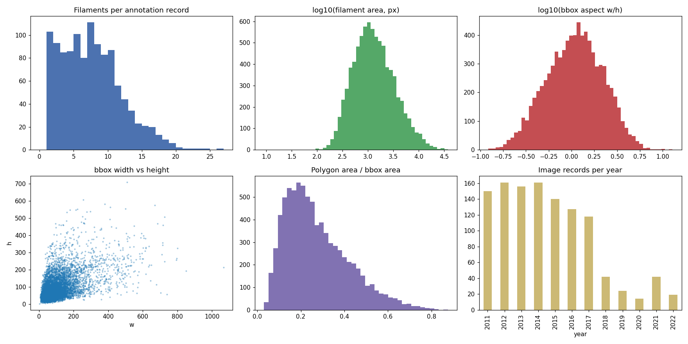
</p>

<p align="center">
  <em>Dataset audit — understanding the structure and distribution of the solar-filament observations.</em>
</p>

---

## 🛰️ 02 — Observational Diversity

Solar observations are not visually uniform.

Different observing conditions and instruments can introduce differences in appearance, contrast, resolution, and structure.

A segmentation system therefore needs to learn the underlying morphology of filaments rather than simply memorizing one visual pattern.

<p align="center">
  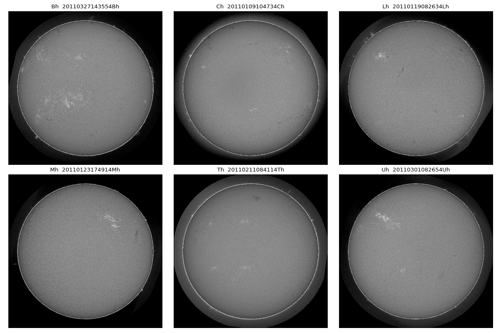
</p>

<p align="center">
  <em>Instrument and observation examples used to understand the visual diversity of the dataset.</em>
</p>

---

## 🎯 03 — What Does a Filament Look Like to the Model?

The training target is not merely:

> **filament present / filament absent**

The model must learn the spatial extent of the structure.

Ground-truth overlays make that objective explicit.

<p align="center">
  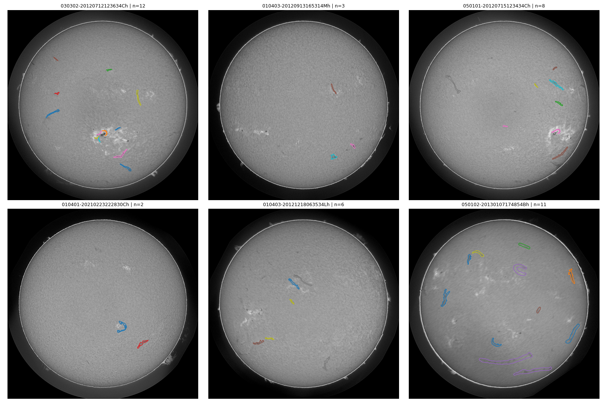
</p>

<p align="center">
  <em>Ground-truth overlays showing the spatial structures the segmentation model is expected to recover.</em>
</p>

---

## 🤝 04 — Annotation Consensus

Scientific image segmentation is ultimately constrained by the quality and consistency of annotations.

Comparing annotations and consensus helps reveal where the definition of a filament is straightforward — and where boundaries become ambiguous.

<p align="center">
  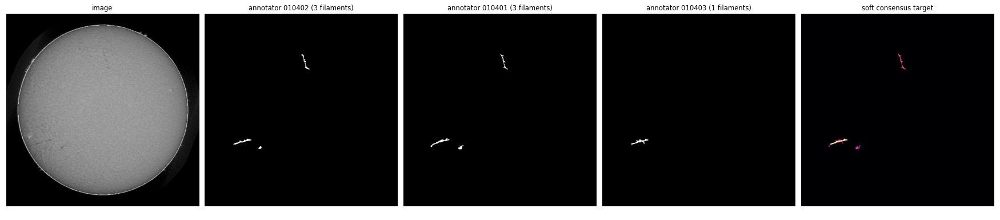
</p>

<p align="center">
  <em>Annotation-consensus analysis illustrating agreement and ambiguity in filament boundaries.</em>
</p>

---

# 🧪 Training the Model

Once the dataset is understood, the next stage is learning.

The model sees many combinations of:

**solar image → filament structure → segmentation mask**

Training batches provide a first qualitative look at whether preprocessing, augmentation, and target masks are behaving as expected.

<p align="center">
  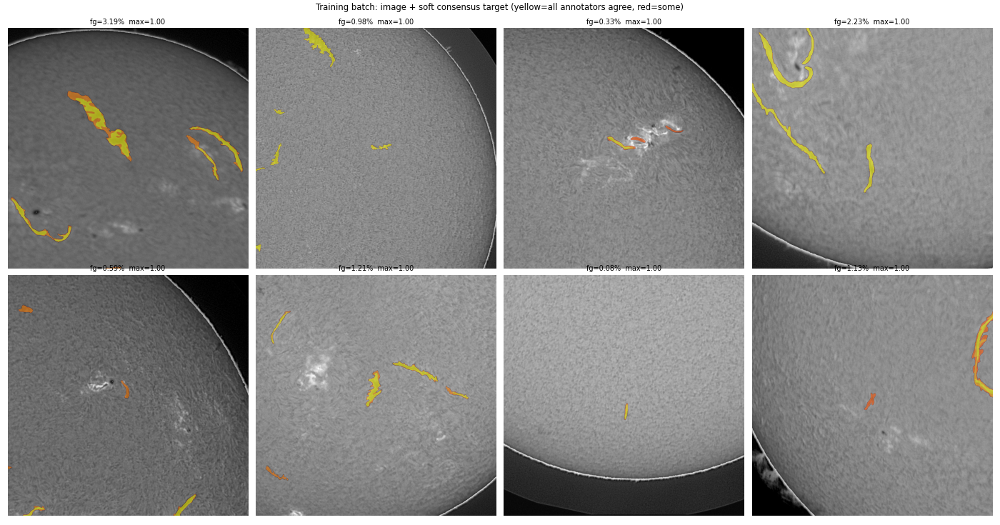
</p>

<p align="center">
  <em>Representative training batch used to inspect image preparation, targets, and augmentation behavior.</em>
</p>

---

# 📈 Does the Model Actually Learn?

A training curve can tell us whether optimization is progressing.

But training performance alone is not enough.

The more important question is whether the model is learning **generalizable filament structure** rather than memorizing the training examples.

<p align="center">
  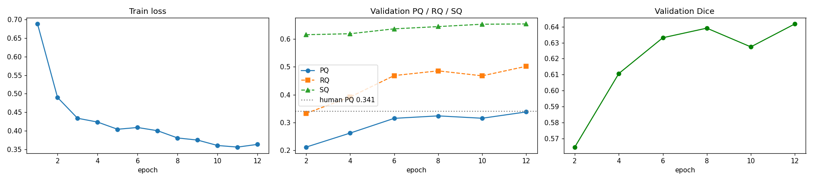
</p>

<p align="center">
  <em>Training dynamics for the first validation fold.</em>
</p>

---

# ⚠️ Overfitting Check

A model can become extremely good at reproducing its training data while becoming worse at recognizing new solar observations.

This is particularly important for scientific computer vision, where visually similar observations can make apparent performance deceptively strong.

<p align="center">
  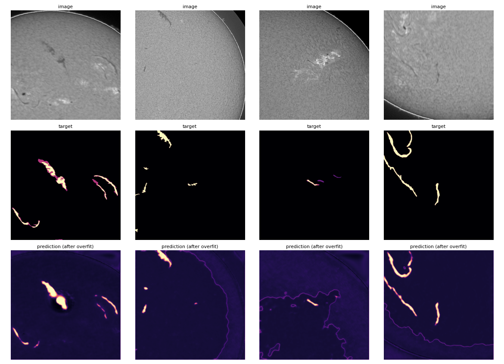
</p>

<p align="center">
  <em>Overfitting diagnostic used to compare model behavior and identify potential generalization problems.</em>
</p>

---

# 🔭 Validation: Does It Find the Filament?

This is where the experiment becomes visually meaningful.

Instead of looking only at a numerical metric, we inspect the predicted masks directly.

<p align="center">
  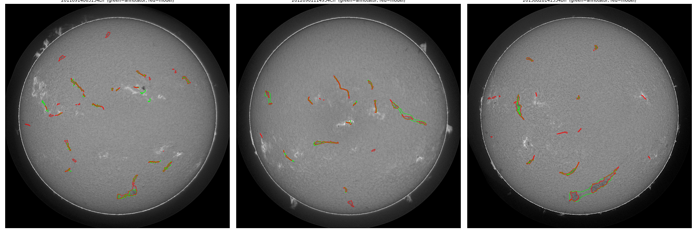
</p>

<p align="center">
  <em>Validation predictions showing how the model reconstructs filament structures on previously unseen observations.</em>
</p>

The most important visual questions are:

* Does the model locate the correct structure?
* Does it capture the full filament?
* Does it preserve fine structures?
* Does it miss faint sections?
* Does it create false positives?
* Does it fragment long structures?
* Does it confuse nearby solar features with filament material?

---

# 🧹 Post-Processing

A neural network's raw prediction is not necessarily its final prediction.

Post-processing can modify the predicted mask to remove noise, reject unlikely regions, or improve structural consistency.

<p align="center">
  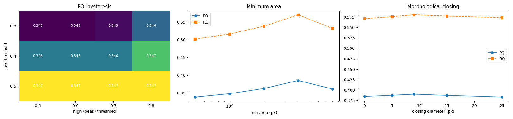
</p>

<p align="center">
  <em>Post-processing parameter sweep used to investigate how prediction refinement affects segmentation quality.</em>
</p>

The objective is not simply to make masks look prettier.

The objective is to determine whether a transformation produces **more accurate scientific segmentation**.

---

# 🧩 Before → After Post-Processing

The effect becomes easier to understand when predictions are viewed directly.

<p align="center">
  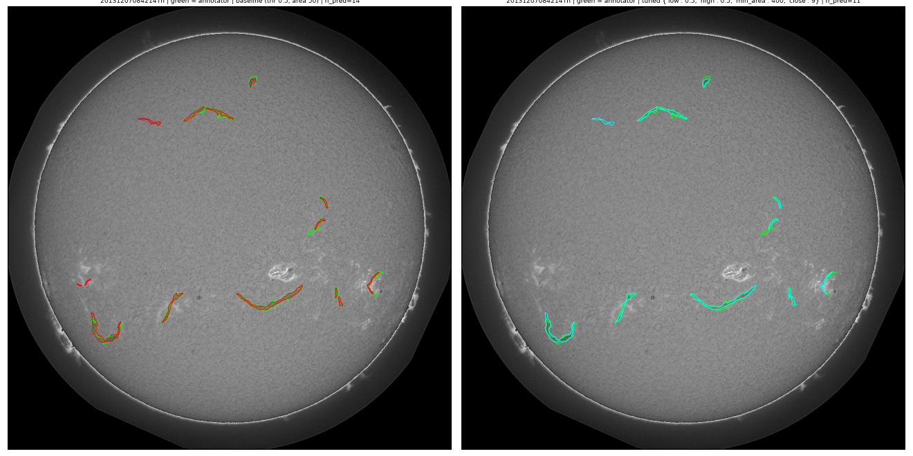
</p>

<p align="center">
  <em>Prediction overlays illustrating the effect of post-processing on filament segmentation.</em>
</p>

---

# 🚀 Final Test Predictions

After the pipeline has been developed and validated, the final stage is inference on unseen test observations.

<p align="center">
  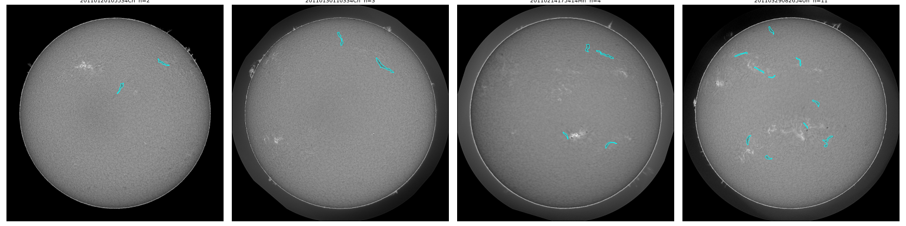
</p>

<p align="center">
  <em>Baseline predictions on test observations — the final visual output of the segmentation pipeline.</em>
</p>

---

# 🧭 From Observation → Science

The complete workflow can be summarized as:

```text
                 ☀️ SOLAR OBSERVATIONS
                          │
                          ▼
                 ┌─────────────────┐
                 │  DATA AUDIT     │
                 └────────┬────────┘
                          │
                          ▼
                 ┌─────────────────┐
                 │  ANNOTATIONS    │
                 │  & CONSENSUS    │
                 └────────┬────────┘
                          │
                          ▼
                 ┌─────────────────┐
                 │  PREPROCESSING  │
                 │  & AUGMENTATION │
                 └────────┬────────┘
                          │
                          ▼
                 ┌─────────────────┐
                 │  DEEP LEARNING  │
                 │   SEGMENTATION  │
                 └────────┬────────┘
                          │
                          ▼
                 ┌─────────────────┐
                 │   VALIDATION    │
                 └────────┬────────┘
                          │
                          ▼
                 ┌─────────────────┐
                 │ POST-PROCESSING │
                 └────────┬────────┘
                          │
                          ▼
                 ┌─────────────────┐
                 │ FINAL PREDICTION│
                 └────────┬────────┘
                          │
                          ▼
                    🧲 FILAMENT MASK
                          │
                          ▼
                 SOLAR PHYSICS ANALYSIS
```

---

# 📚 What These Figures Demonstrate

| Stage                | Scientific Question                              |
| -------------------- | ------------------------------------------------ |
| **Audit**            | What does the dataset contain?                   |
| **Instruments**      | How variable are the observations?               |
| **Ground truth**     | What should the model learn?                     |
| **Consensus**        | How consistent are the annotations?              |
| **Training**         | Is the pipeline learning useful representations? |
| **Learning curves**  | Is optimization progressing?                     |
| **Overfit check**    | Does the model generalize?                       |
| **Validation**       | Can it recover unseen filaments?                 |
| **Post-processing**  | Can predictions be refined reliably?             |
| **Test predictions** | What does the final system produce?              |

The gallery is deliberately organized as a scientific narrative:

**Observe → Annotate → Learn → Validate → Inspect → Refine → Predict**

Every stage leaves visual evidence in this repository.

---

# 📁 Repository Structure

```text
Solar-Filament-Segmentation-Challenge-2026/
│
├── README.md
│
├── project-solar-filament-2026-kaggle-segmentation.ipynb
│
├── figures/
│   ├── 01_audit_stats.png
│   ├── 02_gt_overlays.png
│   ├── 03_instruments.png
│   ├── 04_consensus.png
│   ├── 05_train_batch.png
│   ├── 06_overfit_check.png
│   ├── 07_training_curves_fold0.png
│   ├── 08_val_predictions_fold0.png
│   ├── 09_pp_tuning_fold0.png
│   ├── 10_pp_overlay_fold0.png
│   └── 12_test_predictions_baseline.png
│
└── tables/
    └── .gitkeep
```

---

# 📓 Reproducible Kaggle Workflow

The main executable workflow is contained in:

**`project-solar-filament-2026-kaggle-segmentation.ipynb`**

The notebook documents the experimental pipeline, including:

* Dataset inspection
* Image and annotation analysis
* Preprocessing
* Training
* Validation
* Prediction visualization
* Overfitting diagnostics
* Post-processing
* Evaluation experiments
* Final inference

The objective is to make the experimental process understandable rather than presenting only a final score.

---

# 🌌 Why High Resolution Matters

Solar filaments are often structurally delicate.

A filament may occupy a relatively small portion of an image while extending across a substantial distance.

Aggressive downsampling can remove:

* Fine boundaries
* Narrow structures
* Small fragments
* Low-contrast features
* Morphological details
* Fine barbs

This motivates the use of **1536 × 1536** input resolution in the baseline segmentation experiments.

The guiding principle is:

> **Preserve enough spatial information for the model to learn the structure we actually care about.**

---

# ⚠️ Important Challenges

## Low Contrast

Filaments may be only subtly different from their surrounding solar environment.

## Fine Structure

Barbs and other narrow structures can occupy relatively few pixels.

## Complex Morphology

A single filament can contain bends, branches, fragments, and irregular boundaries.

## Instrument and Observation Variation

Images can differ because of observing conditions and the characteristics of the GONG network.

## Annotation Ambiguity

The precise boundary of a faint filament is not always obvious.

## Background Confusion

Other dark or irregular structures can resemble filament material.

## Generalization

A model must perform well on observations that were not used during training.

These challenges make visual validation especially important.

---

# 🔬 Research Questions

This project is ultimately interested in questions such as:

### Can deep learning recover the morphology of solar filaments?

### How much does high-resolution input improve segmentation?

### How sensitive is performance to preprocessing and augmentation?

### Where does the model fail?

### Which types of filaments are most difficult to segment?

### Can post-processing improve segmentation quality without damaging scientifically meaningful structure?

### Do strong leaderboard results correspond to visually and scientifically convincing predictions?

These questions extend beyond simply training a neural network.

They concern **whether automated computer vision can reliably characterize solar structures at scale**.

---

# 🏛️ Competition Sponsorship

The **Filament Segmentation Challenge 2026** is sponsored by the **U.S. National Science Foundation (NSF) National Solar Observatory (NSO)**.

The National Solar Observatory is the United States' national center for ground-based solar physics and advances research, education, and public outreach in solar science.

NSO is operated by the **Association of Universities for Research in Astronomy (AURA)** under a cooperative agreement with the NSF Division of Astronomical Sciences.

The organization of the Filament Segmentation Challenge 2026 is partially supported by NSF grants:

* **2209912**
* **2433781**
* **2511630**

with support involving the NSF CSE, OAC, and AST Division of Astronomical Sciences, as well as the MPS Directorate.

---

# 📚 References

## MAGFiLO Dataset

Ahmadzadeh, A., Adhyapak, R., Chaurasiya, K. et al.

**A dataset of manually annotated filaments from H-alpha observations.**

*Scientific Data*, 11, 1031 (2024).

DOI:

**10.1038/s41597-024-03876-y**

The publication describes the MAGFiLO dataset, its annotation process, validation, and scientific motivation.

---

## Panoptic Segmentation

Kirillov, A., He, K., Girshick, R., Rother, C., & Dollár, P.

**Panoptic Segmentation.**

Proceedings of the IEEE/CVF Conference on Computer Vision and Pattern Recognition (CVPR), 2019.

DOI:

**10.1109/CVPR.2019.00963**

---

# 🔗 Project Resources

### 📓 Kaggle Notebook

[`project-solar-filament-2026-kaggle-segmentation.ipynb`](./project-solar-filament-2026-kaggle-segmentation.ipynb)

### 🖼️ Research Figures

[`figures/`](./figures/)

### 📊 Experiment Tables

[`tables/`](./tables/)

### ☀️ National Solar Observatory

https://nso.edu/

### 🏆 Competition

Kaggle — **Filament Segmentation Challenge 2026**

https://www.kaggle.com/competitions/filament-segmentation-2026

---

# 🙏 Acknowledgements

This project builds upon the scientific datasets, annotations, evaluation methodology, and infrastructure provided through the **Filament Segmentation Challenge 2026**.

Special acknowledgement is given to the researchers and organizations contributing to the **MAGFiLO** ground-truth data and to the National Solar Observatory and National Science Foundation for supporting solar-physics research and the challenge.

The MAGFiLO dataset represents a substantial human annotation effort and provides an important foundation for machine-learning research on solar filaments.

---

# ⚖️ Disclaimer

This repository represents an experimental computer-vision project developed for the Filament Segmentation Challenge 2026.

Model predictions should not be interpreted as definitive scientific measurements without appropriate validation and domain expertise.

The purpose of this work is to investigate automated segmentation methods and their potential usefulness for solar-filament analysis.

---

# ☀️ Final Perspective

The Sun is not a static ball of light.

Its atmosphere is structured by powerful magnetic fields, producing dynamic features that evolve across multiple spatial and temporal scales.

Solar filaments are one manifestation of that magnetic complexity.

They are visually subtle structures, but they can be connected to some of the most consequential events in space weather.

That makes automated filament detection more than a computer-vision exercise.

It is potentially part of a larger effort to understand and monitor the Sun.

Computer vision provides a way to turn those visual structures into measurable data.

The challenge is therefore to move from:

**observation → segmentation → measurement → scientific understanding**

The leaderboard provides one indication of performance.

The masks provide another.

The underlying solar physics provides the ultimate context.

> ## 🔬 The goal is not simply to detect something dark on the Sun.
>
> ## **The goal is to teach a machine to recognize the magnetic structures that can help us understand the Sun — and the space weather it can create.**
